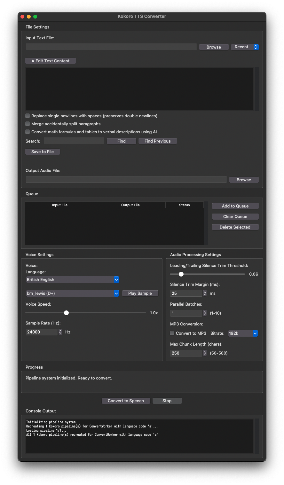
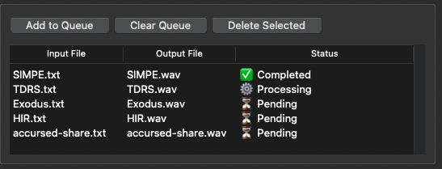

# Kokoro TTS GUI

A graphical user interface for the Kokoro text-to-speech system with advanced features for processing long texts.



## Features

- **Fast and high quality** text to speech conversion, thanks to Kokoro-82M
- **Easy-to-use cross-platform GUI with native look-and-feel** for converting text files to high-quality speech
- **Multilingual support** with voices in 9 languages including American English, British English, Japanese, Mandarin Chinese, Spanish, French, Hindi, Italian, and Brazilian Portuguese
- **51 different voice options with quality grades** to help you choose the best voice for your needs, with the ability to control voice speed and play voice samples
- **Progress tracking** with real-time status updates, a propotional progress bar, and estimated time remaining
- **Support for MP3 output with specified bitrate** so that when you get a final WAV file, you can easily convert it to something smaller and more efficient
- **Advanced text processing** with automatic sentence splitting and long sentence handling
- **Exception-proof resume capability** so that you never lose progress on a long running project!
- **Pause and stop functionality** that allows you to resume later or stop without saving progress, based on the same resume capability features
- **Real-time console output** showing detailed processing information
- **An advanced queuing system** that allows you to queue up multiple texts to be converted to speech audio, and monitor their progress, as well as individually remove or stop them, as well as pause the queue even mid-conversion of a text and then resume right where you left off later
- **Parallel batch processing** that uses threads to process multiple chunks simultaneously, dramatically increasing conversion speed - going from 1 to 5 batches reduced conversion time from 2 minutes 50 seconds to just 1 minute 52 seconds! Note that increasing batch size has logarithmically diminishing returns, as going from 5 to 8 batches only reduced the conversion time by another 20 seconds.

## Unique Features

The reason I made this app instead of using one of the many, many existing options, was that they all lacked two key features that my version has:

### Resume capability
As chunks are converted, this program streams the chunk audio to an uncompressed wav file, so that if a sigterm or sigint is received, or the user quits the app, hits pause, or even if an exception is raised, all that needs to be done to save the progress achieved up until that point is to save a lockfile detailing which chunk the conversion left off at and what the conversion settings were, and then safely close the sound file. 

This doesn't just ensure that what was already done isn't lost, either: this program is capable of resuming from where it left off based on the lockfile, *continuing to add more audio to the previously incomplete audio file*, thus allowing arbitrary and seamless error recovery.

This is so seamless that it even allows the user to manually *choose* to pause conversion, if for instance they're doing it on a laptop and will be on battery power or out of batter for some amount of time, or need the compute for something else, and then resume it hassle-free. It also allows the conversion to be manually stopped partway, while still producing a perfectly fine audio file, in case only part of the input text needs to be converted for whatever reason.

### Low, constant memory usage

Thanks to the fact that all audio is written directly to the output file as soon as it is synthesized, it can immediately be deleted from memory, meaning that instead of monotonically rising memory usage that may eventually lead to an out of memory error or the computer crashing --- which has happened to me with mlx-audio --- this app consistently only uses about 400MB of memory, and that does not rise over time.

### Long sentence handling
Kokoro-82M text-to-speech degrades after ~250 characters; this causes problems for existing Kokoro TTS solutions, which split by sentence, but don't actually check to make sure sentences are small enough for it to process before feeding them into the model: long sentences can drop words or become whispers at the end. I implemented a recursive algorithm that first splits text at natural syntactic boundaries (semicolons, colons, emdashes, commas, conjunctions), then falls back to greedy word fitting if needed, to ensure that all chunks fed to Kokoro-82M are always below the character limit. After generating audio for each chunk, I then reassemble them with precisely trimmed silence, insert sentence pauses, and add double pauses at paragraph breaks, resulting in clear, accurate audio.

### Queuing

Since converting a text, even with Kokoro-82M on a relatively fast machine, can take some time, I don't want to have to manually intervene to load the next one each time. As a result, I built a serviceable queuing system workflow (which is optional, to maintain ergonomics for single files) that allows you to add to the queue, delete from the queue, clear the queue, and pause/resume the whole queue (even if you do it in the middle of converting a specific file, thanks to the resume capability!), as well as giving you status updates on the progress of each queue item:



## Installation

1. Clone the repository:
   ```bash
   git clone https://github.com/alexispurslane/kokoro-audiobook-reliable.git
   cd kokoro-audiobook-reliable
   ```

2. Install dependencies using uv:
   ```bash
   uv sync
   ```

## Usage

Run the GUI application:
```bash
uv run main.py
```

## System Requirements

- Python 3.10 or higher (but less than 3.13)
- uv (for dependency management)
- ffmpeg <= 7.0

## How to Use

1. Select a text file to convert to speech
2. Choose an output file path for the audio
3. Select a language from the language dropdown
4. Choose a voice option from the available voices for that language, with quality grades displayed to help you choose
5. Adjust silence trimming parameters if desired:
   - **Silence Trim Threshold**: Controls sensitivity of silence detection (0-0.5)
   - **Silence Trim Margin**: Extra samples to keep before/after detected sound (0-500ms)
6. Click "Convert to Speech" to start the conversion
7. Monitor progress in the progress bar and console output
8. Use "Pause" to interrupt and save progress for later resumption, or "Stop" to end without saving progress
9. Your audio file will be saved to the specified location

## Note

This project was written as an experiment with agentic AI coding, using OpenCode with GLM 4.5 and Qwen 3 Coder. All diffs were carefully reviewed, all algorithms, features, and the logic of implementing those features were described to the AI by me (although it did fill in the blanks here and there), and I've asked it to, or manually myself, refactored and cleaned the code up multiple times. Nevertheless, this was a somewhat vibe-coded project, more than I'd usually be comfortable with if that wasn't the purpose of this experiment: I'm intimately familiar with what the code does on a specific level, how it does it, and why, and what functions exist and how they relate to each other, but I am less familiar with the spatial layout of the codebase, and since this is a personal script and not a long term enterprises project, I've sort of not worried about really factoring out the architecture much.
